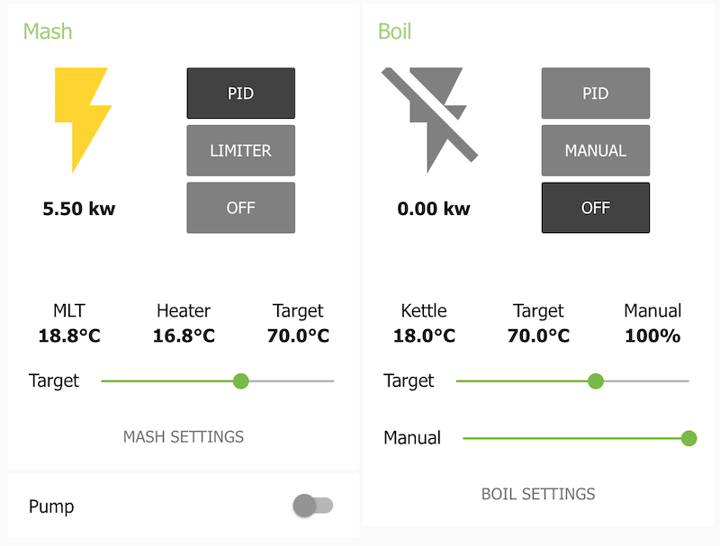
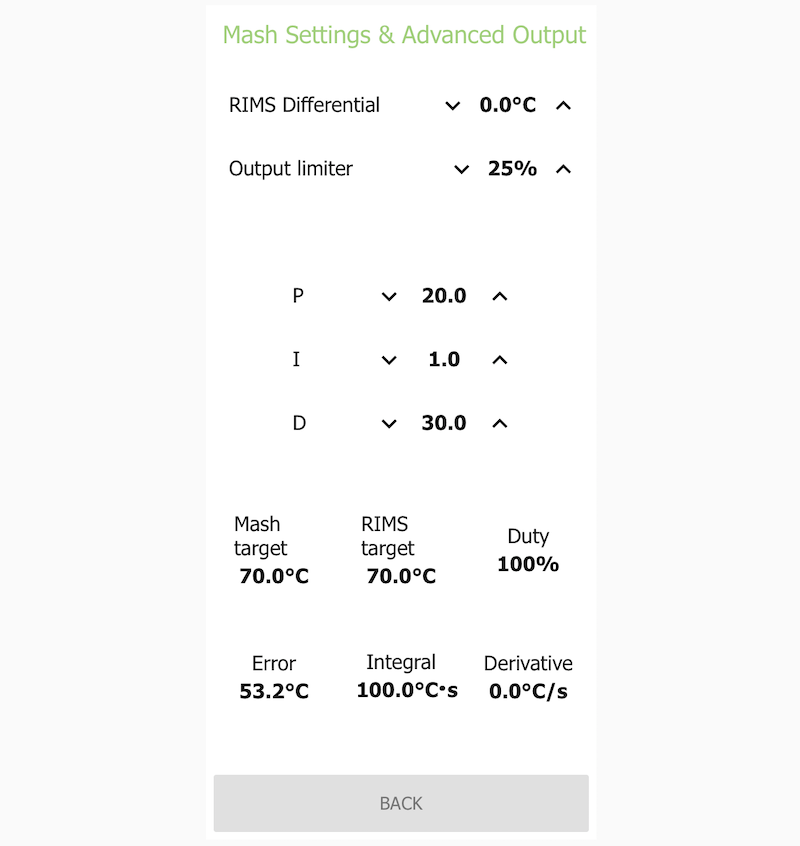

<h1>brew2<h1>

<h3>Description</h3>

This is a dashboard for brewery control, built using [Node-RED](https://github.com/node-red/node-red) running on a Raspberry Pi.

This dashboard is specific to [my brewery](https://onbrewing.com), which is a 2 vessel and 1 pump system designed to perform recirculating, full volume mashes. Other homebrewers may find the flows that comprise this dashboard useful in implementing some of the same features in their own brewery controller, but it will likely not suit their needs exactly as is. I am unable to provide support to anybody in adapting this dashboard to their system, but you are free to use any of my work for your own purposes. Note that the screenshots included in this repository may not always be current!

<h3>Features</h3>
<ul>
<li>PID temperature control of mash (using RIMS), with output limiting functionality</li>
<li>PID temperature control and manual control options of a boil kettle</li>
<li>Output blocking to ensure only a single element is used at once</li>
<li>Looks nice</li>
</ul>

<h3>Screenshots</h3>

<h3>License</h3>
<b>MIT License</b>

<i>Copyright (c) 2018-2019 Justin Angevaare</i>

Permission is hereby granted, free of charge, to any person obtaining a copy
of this software and associated documentation files (the "Software"), to deal
in the Software without restriction, including without limitation the rights
to use, copy, modify, merge, publish, distribute, sublicense, and/or sell
copies of the Software, and to permit persons to whom the Software is
furnished to do so, subject to the following conditions:

The above copyright notice and this permission notice shall be included in all
copies or substantial portions of the Software.

THE SOFTWARE IS PROVIDED "AS IS", WITHOUT WARRANTY OF ANY KIND, EXPRESS OR
IMPLIED, INCLUDING BUT NOT LIMITED TO THE WARRANTIES OF MERCHANTABILITY,
FITNESS FOR A PARTICULAR PURPOSE AND NONINFRINGEMENT. IN NO EVENT SHALL THE
AUTHORS OR COPYRIGHT HOLDERS BE LIABLE FOR ANY CLAIM, DAMAGES OR OTHER
LIABILITY, WHETHER IN AN ACTION OF CONTRACT, TORT OR OTHERWISE, ARISING FROM,
OUT OF OR IN CONNECTION WITH THE SOFTWARE OR THE USE OR OTHER DEALINGS IN THE
SOFTWARE.
